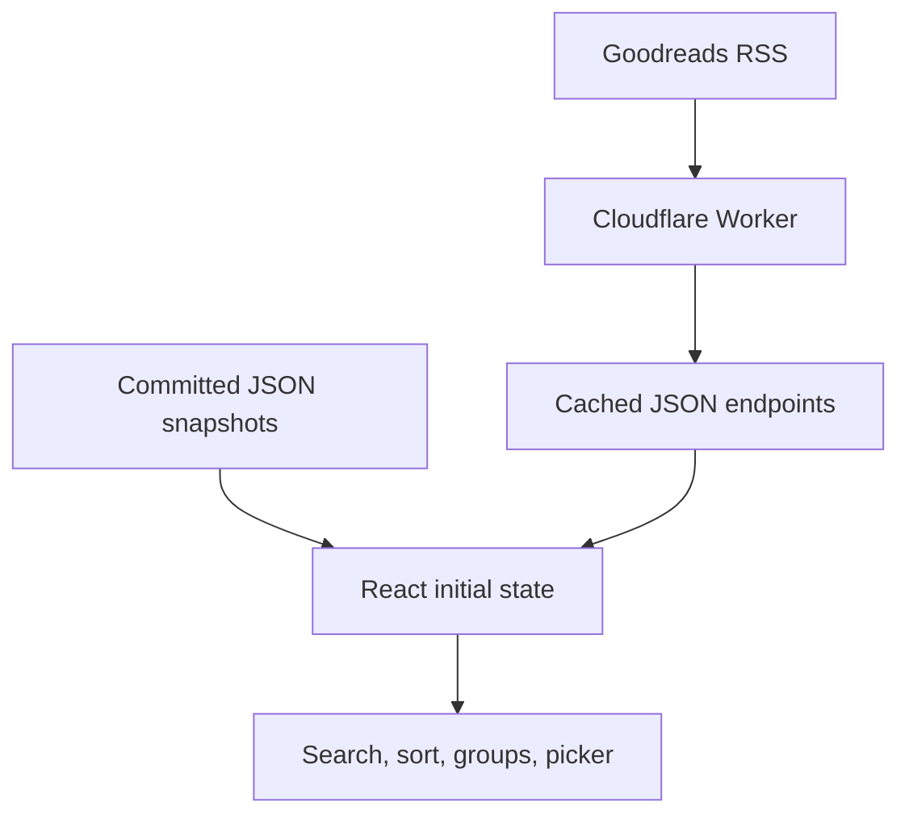

# njmurray books

Reading-list application at `books.njmurray.com`. A React interface displays read and want-to-read Goodreads shelves, while a Cloudflare Worker provides live RSS-derived data and serves the built frontend.

The application uses two layers of book data:

- committed JSON snapshots provide an immediate, reliable first render;
- live Worker endpoints replace those snapshots when fresh Goodreads data is available.

## Architecture



This split allows the site to remain useful during a Goodreads or network failure without forcing every visitor to see permanently stale data.

## Frontend boot sequence

Vite starts from `index.html`, loads `src/main.jsx`, and mounts `App` into the root element.

`App.jsx` imports:

```js
import staticBooks from "./data/books.json";
import staticWantToRead from "./data/wantToRead.json";
```

These arrays become the initial values of `bookData` and `wantToReadData`. The page can therefore render complete content before any runtime API request finishes.

After the first render, a `useEffect` requests both live endpoints in parallel:

```text
/api/books.json
/api/want-to-read.json
```

Each response is handled independently:

- a successful JSON array replaces that shelf’s in-memory snapshot;
- a non-success response is ignored;
- a network or JSON error is ignored;
- a non-array JSON payload is ignored.

If one endpoint succeeds and the other fails, only the successful shelf updates. The cleanup flag prevents state changes after the component unmounts.

## Worker request routing

`worker/index.js` distinguishes API requests from static asset requests.

| Path | Behaviour |
| --- | --- |
| `/api/books.json` | Return normalised Goodreads `read` shelf data. |
| `/api/want-to-read.json` | Return normalised Goodreads `to-read` shelf data. |
| Existing static asset | Serve through the `ASSETS` binding. |
| Missing path with a file extension | Preserve the asset `404`. |
| Missing extensionless path | Serve `/index.html` as a client-side route fallback. |

The route fallback allows extensionless browser routes without hiding missing JavaScript, CSS, image, or other asset errors.

## Live Goodreads pipeline

### RSS retrieval

The Worker uses a public Goodreads user ID and builds an RSS URL for each shelf.

Retrieval parameters:

| Setting | Value |
| --- | --- |
| Items requested per page | `200` |
| Maximum pages | `10` |
| Theoretical shelf cap | `2,000` records |

Pages are fetched sequentially. Retrieval stops as soon as a page contains fewer than 200 records, indicating the end of the shelf.

Every request sends explicit XML `Accept` values and a stable application user agent. A non-success Goodreads response fails the complete shelf refresh rather than returning a partial array.

### XML parsing

`fast-xml-parser` converts the RSS response into JavaScript. A single `<item>` and an array of `<item>` elements are normalised through `ensureArray()`.

Each item is reduced to a stable book shape:

```json
{
  "id": "154869",
  "goodreadsId": "154869",
  "title": "Fat City",
  "shortTitle": "Fat City",
  "author": "Leonard Gardner",
  "isbn": "0520206576",
  "rating": 4,
  "pageCount": 183,
  "yearPublished": 1969,
  "dateRead": "2026-07-21",
  "dateAdded": "2026-07-21",
  "shelves": "read",
  "review": "",
  "readCount": 1,
  "goodreadsUrl": "https://www.goodreads.com/book/show/154869",
  "remoteCover": "https://..."
}
```

Empty, `null`, and `undefined` fields are removed.

Normalisation rules include:

- extract a Goodreads ID from dedicated fields or the book URL;
- remove series suffixes such as `(Series, #1)` from `shortTitle`;
- strip non-ISBN characters;
- parse numeric values as integers;
- reduce dates to `YYYY-MM-DD`;
- remove HTML from review text;
- reject placeholder cover URLs;
- choose the first usable cover from large to small Goodreads images.

Records lacking either a Goodreads ID or a title are discarded.

### Ordering

Live arrays are sorted newest-first using:

1. `dateRead`;
2. `dateAdded` when no read date exists;
3. title as a deterministic tie-break.

The frontend later re-sorts the array according to the selected view, so this Worker order mainly controls the default state and recent-cover selection.

## Edge caching

Live shelf responses use both the Cache API and response cache headers.

The effective cache key replaces all incoming query parameters with:

```text
?v=2026-06-21-per-page-200
```

This makes incidental query strings irrelevant and provides a manual version switch for invalidating old cache entries after data-shape or pagination changes.

Successful responses send:

```http
Cache-Control: public, max-age=300, s-maxage=86400
```

The browser may reuse a response for five minutes, while shared caches may retain it for 24 hours. Error responses use `no-store`.

On a cache miss:

1. the Worker fetches and normalises the complete shelf;
2. returns the response immediately;
3. writes a clone into `caches.default` through `ctx.waitUntil()`.

The cron in `wrangler.toml` runs at `06:24 UTC` each day:

```text
24 6 * * *
```

It refreshes both canonical endpoint cache keys proactively. The scheduled refresh does not modify the committed JSON snapshots.

## Frontend state and derived data

The main React state is:

```js
{
  sortBy: "date-read",
  viewMode: "grid",
  query: "",
  bookData: staticBooks,
  wantToReadData: staticWantToRead
}
```

Filtering, sorting, section grouping, favourites, hero covers, and want-to-read covers are derived with `useMemo()` so they are recalculated only when their relevant inputs change.

### Search

The case-insensitive search combines:

- full title;
- short title;
- author;
- additional authors;
- publisher;
- shelf text.

Search affects the main sections and favourites. It does not filter the want-to-read picker.

### Sort and grouping rules

| Sort | Ordering | Section grouping |
| --- | --- | --- |
| Date read | Newest date first | Read year, newest year first |
| Rating | Highest rating, then newest read date | Rating value, then Unrated |
| Title | Alphabetical title | Single `All Books` section |
| Author | Alphabetical author, then title | Single `All Books` section |
| Year published | Newest publication year first | Decade |
| Pages | Highest page count first | Page-length category |

Page-length groups are:

| Group | Page range |
| --- | --- |
| Epics | `800+` |
| Long Reads | `600–799` |
| Standard Reads | `400–599` |
| Short Reads | `200–399` |
| Quick Reads | `1–199` |
| Unknown | no page count |

The five-star favourites section is always sorted by most recent read date, independently of the selected sort.

### Grid and list views

Grid cards display:

- cover;
- short title;
- author;
- five-star rating;
- read month/year or publication year.

List rows display the fuller title and author metadata, read date, page count, and publication year.

Titles link to the explicit `goodreadsUrl` when present, otherwise a URL is constructed from `goodreadsId` or `id`.

### Cover handling

`getCoverUrl()` prefers `localCover` over `remoteCover`. A remote image failure is remembered inside the `Cover` component and replaced with a text fallback derived from the first letters of the first two title words.

Images use native lazy loading except for the prominent want-to-read or hero covers.

### Want-to-read picker

When the want-to-read shelf contains usable covers, one is selected at random for the hero.

Selecting the cover starts a sequence of progressively slower timeouts. Each step chooses a random index different from the current one, producing a decelerating spin effect. Timeout IDs are retained and cleared before a new spin and when the component unmounts.

If no want-to-read cover is available, the hero falls back to up to eight recent read books with usable covers.

## Committed snapshot refresh

`scripts/refresh-goodreads.mjs` updates:

```text
src/data/books.json
src/data/wantToRead.json
```

It is separate from the runtime Worker and supports two input paths:

- Goodreads RSS;
- a Goodreads CSV export.

For the read shelf, an available CSV is merged first and RSS is merged afterward. Incoming records are indexed by the first available stable key:

```text
goodreadsId → id → isbn13 → isbn → title
```

Incoming data normally wins, but selected fields from an existing record are preserved when the incoming source omits them:

- additional authors;
- publisher;
- binding;
- page count;
- publication years;
- shelves;
- review;
- local cover.

An existing remote cover is also preserved when the incoming cover is missing or recognised as a placeholder.

CSV records can derive covers from Open Library by ISBN. RSS records prefer Goodreads image URLs and fall back to Open Library in the snapshot script. The runtime Worker currently uses Goodreads cover URLs only.

Files are rewritten only when the pretty-printed JSON content actually changes.

## Failure behaviour

| Failure | Result |
| --- | --- |
| Live API request fails in the browser | Committed snapshot remains visible. |
| One shelf endpoint fails | The other shelf can still refresh. |
| Goodreads returns an error to the Worker | Endpoint returns `502` with `no-store`. |
| RSS page is malformed or fails mid-pagination | Complete live shelf refresh fails; no partial result is cached. |
| Cover image fails | Initials-based cover fallback appears. |
| Static route does not exist | Extensionless routes receive the app shell; asset-like routes remain `404`. |
| Scheduled refresh fails | Existing cached and bundled data remain available. |

## File map

| File | Responsibility |
| --- | --- |
| `index.html` | Vite document shell and React mount point. |
| `src/main.jsx` | React bootstrap. |
| `src/App.jsx` | Fetch-on-mount, state, search, sorting, grouping, display components, cover fallback, and picker. |
| `src/styles.css` | Responsive layout and component styling. |
| `src/data/books.json` | Bundled read-shelf snapshot. |
| `src/data/wantToRead.json` | Bundled to-read snapshot. |
| `worker/index.js` | API routing, RSS retrieval, normalisation, edge caching, cron refresh, and static asset fallback. |
| `scripts/refresh-goodreads.mjs` | RSS/CSV import, record merging, and committed snapshot updates. |
| `vite.config.js` | Frontend build configuration. |
| `wrangler.toml` | Worker entry point, asset binding, custom domain, and daily cron. |

## Change map

| Change | Main location |
| --- | --- |
| Goodreads account or shelf endpoints | constants in `worker/index.js` and snapshot script defaults |
| Live cache lifetime | `GOODREADS_CACHE_TTL_SECONDS` and response headers |
| Force cache invalidation | `GOODREADS_CACHE_VERSION` |
| RSS page size or cap | pagination constants in Worker and snapshot script |
| Book normalisation | `normalizeRssBook()` and corresponding snapshot functions |
| Snapshot merge preservation | `mergeBook()` |
| Searchable fields | `filteredBooks` in `App.jsx` |
| Sort order | `sortBooks()` |
| Section categories | `groupBooks()` |
| Grid/list card content | `BookCard()` and `BookRow()` |
| Want-to-read animation | `WantToReadPicker()` |
| Cover priority and fallback | `getCoverUrl()` and `Cover()` |
| Daily refresh time | cron in `wrangler.toml` |

## Design constraints

- Goodreads RSS is the live source and can change format or availability independently.
- Snapshot and runtime normalisers duplicate some logic and should stay aligned.
- The live cache and committed snapshots are separate; refreshing one does not refresh the other.
- The browser does not persist sort, view, search, or picker state.
- Goodreads data is read-only; the application never writes ratings, shelves, or reviews back to Goodreads.
